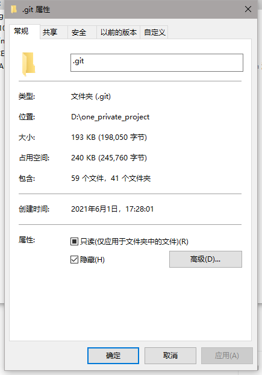

# one_private_project
LanZhou University data science 2021 CI 102/103 project
Created by TianYi Wang(project manager)
## 预览
由于兰州大学校园内的防火墙限制，此网站目前只能在校园内网范围内访问，连接内网后直接输入网址 http://project.childishliittlecherry.top/ 即可访问。


## 前端
使用Vue.js
## 后端
使用Django

## 框架
框架采用开源的Vue+Django的框架，并使用google新推出的PWA模式。
框架链接：https://github.com/kevinqqnj/django-vue-template
## 反向代理
使用nginx做反向代理和负载均衡

## 附
(由于此仓库为期末大作业，将在大作业成绩出来后上传代码)


## 个人贡献
### 王天一
#### nginx_configuration
反向代理的配置文件
#### 项目协调

#### server_configuration 服务器配置
经我们测试，此项目可以在以下环境中运行：

MySQL 10.3.27   
Python 3.7.3  
Django 2.1.4  
Nginx 1.14.2 (为了实现最好的负载均衡功能，建议在服务器上下载源码自己编译安装)
#### 安全调试
首先我们为了安全起见，并未使用宝塔等等落后的面板服务器配置，而是选择了自己搭建整体的服务环境，大大降低了安全隐患。  
在第一次安全测试中，发现根文件夹存在Git泄露的问题，可能会不安好心的人漏洞可钻，于是我们立即做出了删除的处理。  
  
其次，我们考虑到使用HTTPS能够大大加强数据的安全性，我们在DNSpod上申请了网站专属的SSL证书。采用CAS加密算法使网络通信被劫持成为不可能。

#### fixed_bugs
##### bug_1_keyerror(uid)
初次测试运行时，发生了keyerror的错误 
.png)
后将  
    ```
    response['uid'] = request.session('uid')
    ``` 
改为 
    ```
    response['uid'] = request.session.get('uid',None)
    ```
后正常运行
### 刘林昊
#### 后端

### 禹中元
#### 后端

### 王琛
### 廖冀远

